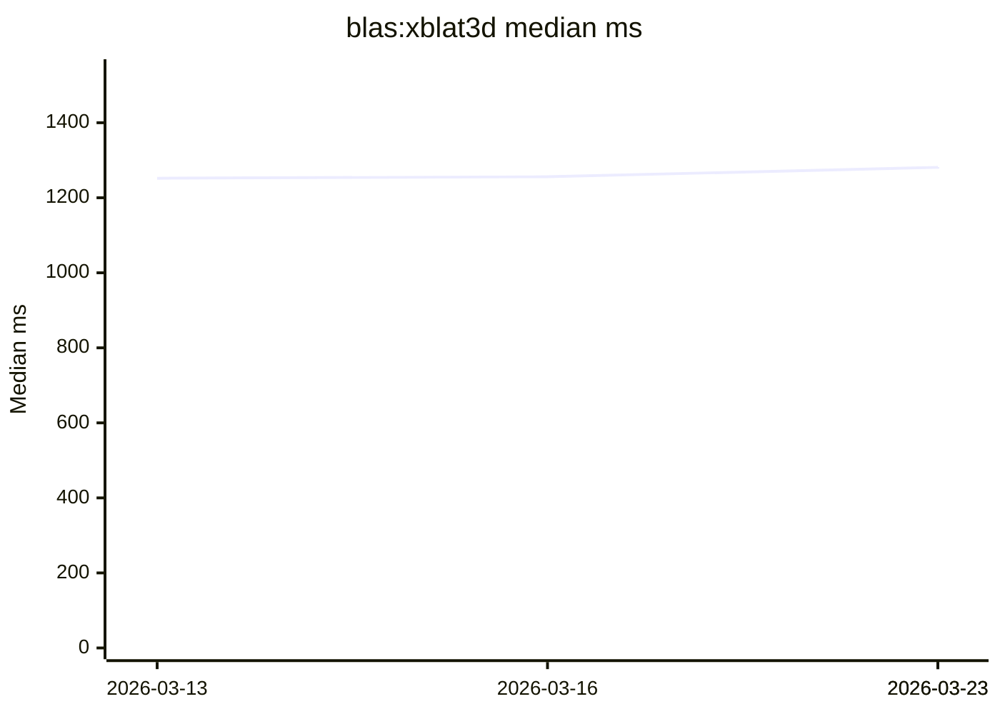
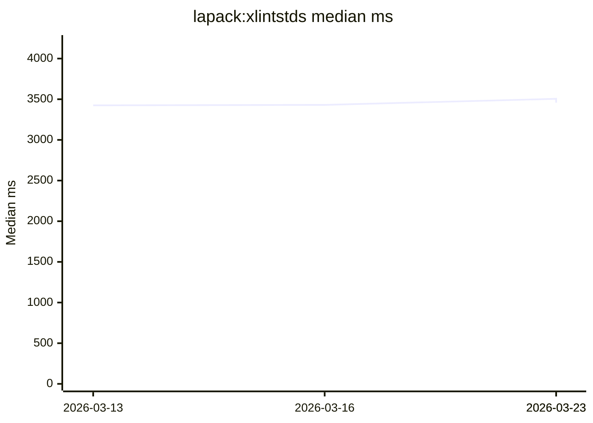

# Performance Dashboard

Auto-generated from the weekly performance workflow.

- Latest run: `2026-03-23`
- Commit: `5efee15b4373ee7ca2f9119ec04d8eb0aeb67d93`
- Samples: iterations `3`, warmup `1`

## Latest Snapshot

| Case | Median (ms) | Mean (ms) | Previous Median (ms) | Delta |
| --- | ---: | ---: | ---: | ---: |
| `blas:xblat3d` | 1282.000 | 1282.667 | 1281.000 | 0.08% |
| `lapack:xlintstds` | 3457.000 | 3473.333 | 3505.000 | -1.37% |

## Trend Charts (Last 12 Runs)

### `blas:xblat3d`

### `lapack:xlintstds`

## Recent History (Last 12 Runs)

| Run | Commit | `blas:xblat3d` | `lapack:xlintstds` |
| --- | --- | ---: | ---: |
| `2026-03-13` | `e09f5c7cee5bce7c2e1d3a32eefe07f08273216f` | 1252.000 | 3425.000 |
| `2026-03-16` | `3ae72d38f143500a2f3d9a0c76e09fec2f4191e4` | 1256.000 | 3430.000 |
| `2026-03-23` | `5e09dbc138efaab08e29d1c3c5dde3bb3cd94622` | 1281.000 | 3505.000 |
| `2026-03-23` | `5efee15b4373ee7ca2f9119ec04d8eb0aeb67d93` | 1282.000 | 3457.000 |
