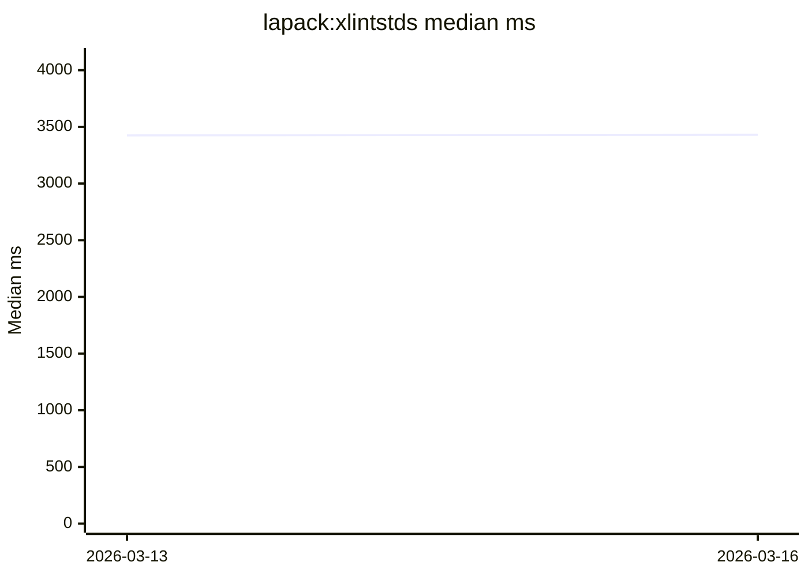

# Performance Dashboard

Auto-generated from the weekly performance workflow.

- Latest run: `2026-03-16`
- Commit: `3ae72d38f143500a2f3d9a0c76e09fec2f4191e4`
- Samples: iterations `3`, warmup `1`

## Latest Snapshot

| Case | Median (ms) | Mean (ms) | Previous Median (ms) | Delta |
| --- | ---: | ---: | ---: | ---: |
| `blas:xblat3d` | 1256.000 | 1273.000 | 1252.000 | 0.32% |
| `lapack:xlintstds` | 3430.000 | 3446.667 | 3425.000 | 0.15% |

## Trend Charts (Last 12 Runs)

### `blas:xblat3d`

```mermaid
xychart-beta
    title "blas:xblat3d median ms"
    x-axis ["2026-03-13", "2026-03-16"]
    y-axis "Median ms" 0 --> 1508
    line [1252, 1256]
```

### `lapack:xlintstds`



## Recent History (Last 12 Runs)

| Run | Commit | `blas:xblat3d` | `lapack:xlintstds` |
| --- | --- | ---: | ---: |
| `2026-03-13` | `e09f5c7cee5bce7c2e1d3a32eefe07f08273216f` | 1252.000 | 3425.000 |
| `2026-03-16` | `3ae72d38f143500a2f3d9a0c76e09fec2f4191e4` | 1256.000 | 3430.000 |
