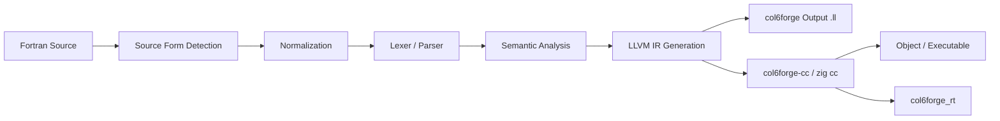

# Col6Forge

<div align="center">

**A Fortran Frontend and Compiler Driver Written in Zig**

Starting from `.f/.for/.f77/.f90/.f95/.f03` inputs, going through lexical/parsing/semantic analysis and LLVM IR generation, and finally utilizing `zig cc` to build object files or executables.

</div>

## Project Overview

Col6Forge is currently not a "wrapper script for gfortran", but a genuine, standalone frontend pipeline:

1.  Reads Fortran source files.
2.  Automatically detects fixed form / free form.
3.  Normalizes logical lines while preserving source location mappings.
4.  Executes lexical, parsing, and semantic analysis.
5.  Generates LLVM IR.
6.  In `cc` mode, passes the generated IR along with the runtime to `zig cc` for compilation/linking.

There are two main entry points:

- `col6forge`
  Directly runs the frontend pipeline and outputs LLVM IR.
- `col6forge cc` / `col6forge-cc`
  Processes Fortran inputs in a manner similar to `cc`, and passes non-Fortran inputs and additional arguments transparently to `zig cc`.

The repository also includes multiple built-in development toolsets for golden testing, NIST F78 validation, GCC `gfortran.dg` compilation validation, BLAS/LAPACK validation, performance regression comparison, error code documentation generation, and architecture auditing.

## Current Implementation Scope

### Language Frontend

- Supports fixed form and free form inputs, with heuristic auto-detection based on extensions and content.
- Fixed form normalization covers classic column rules, and is compatible with tab-format as well as continuation variants shifted right by one or two columns.
- Diagnostics for both free form and fixed form attempt to fall back to the original source row and column, rather than solely reporting the normalized logical line position.

### Language Support Status

**Stable (Production Ready)**
- **F77 Core**: Fixed-form source, basic types (INTEGER, REAL, DOUBLE PRECISION, COMPLEX, LOGICAL, CHARACTER), `COMMON`, `DO`/`IF`, `SUBROUTINE`/`FUNCTION`, `ENTRY`, alternate returns
- **F90 Arrays**: `ALLOCATABLE`, array constructors `[...]`, basic array operations
- **F2003 OOP Basics**: Derived types, `EXTENDS` (type inheritance), member access

**Experimental (Parsed but Incomplete Codegen)**
- **F90 Modules**: `MODULE` syntax parsed, but procedures inside modules may fail to link
- **F2003 C Interop**: `BIND(C)` and `iso_c_binding` parsed, but symbol generation incomplete
- **SUBMODULE**: Syntax recognized, but codegen not fully implemented
- **Advanced Features**: `INTERFACE`, generic interfaces, type-bound procedures, `ABSTRACT`, deferred bindings

**Not Supported**
- **F2008+ Concurrency**: `DO CONCURRENT`, Coarrays, `SYNC` statements
- **F2008+ Parallel**: No parallel runtime features
- **Advanced F2003**: Procedure pointers, abstract interfaces with complex signatures

### Additional Coverage

- `CONTAINS` internal procedures
- `USE`, `ONLY`, rename, and module prelude propagation
- `EQUIVALENCE` consistency checks
- Implicit typing rules
- Intrinsic resolution and arity checks for calls

### Code Generation and Runtime

- The currently exposed `EmitKind` is only `llvm`, representing LLVM IR.
- The `cc` mode automatically links the `col6forge_rt` runtime when Fortran inputs are present.
- The runtime source tree already includes modules for formatted I/O, list-directed I/O, binary/direct/unformatted I/O, dynamic formats, `PAUSE`, and complex/integer helpers.
- Optional runtime array bounds checking and `PAUSE` behavior control have been integrated into the command line.

### Toolchain and Validation

- `zig build check` for fast compilation-level regression checks.
- `zig build test` to run Zig unit tests.
- `zig build golden` / `diagnostic-golden` / `cc-diagnostic-golden` for golden validation.
- `zig build verify` for NIST F78 execution validation.
- `zig build gcc-dg-verify` for GCC `gfortran.dg` compilation validation.
- `zig build blas-verify` / `lapack-verify` for numerical library validation.
- `zig build perf-bench` / `perf-compare` / `perf-dashboard` for performance profiling, comparison, and historical dashboard generation.

## Overall Architecture



The pipeline stages have explicit profile sampling points in the source code:

- `read`
- `normalize`
- `parse`
- `semantic`
- `codegen`
- `pipeline`

When `-ftime-report` or `--time-report` is enabled, the CLI will output a total/read/normalize/parse/sema/codegen elapsed time summary to standard error.

## Repository Structure

| Path | Purpose |
| --- | --- |
| `src/main.zig` | Main CLI entry point, handles both IR mode and `cc` driver mode |
| `src/root.zig` | Exported library API, exposing frontend, semantics, codegen, and pipeline capabilities |
| `src/frontend/` | Fixed/free form normalization, lexical and syntax analysis |
| `src/semantic/` | Semantic analysis, symbols/scopes, constraint checking |
| `src/codegen/` | LLVM IR generation |
| `src/runtime/` | `col6forge_rt` runtime implementation |
| `src/driver/` | Pipeline and `cc` driver |
| `src/tools/` | Tools for golden/verify/gcc-dg/BLAS/LAPACK/perf/docgen/audit, etc. |
| `tests/` | Test assets including NIST F78, GCC, BLAS, LAPACK, MINPACK, diagnostic golden, etc. |
| `docs/` | Supplementary documentation; may lag behind except for error code docs |
| `scratch/` | Experimental examples and mixed-language experiments |

## Environment Requirements

- Zig: `0.15.2` or higher
- It is recommended to execute all commands in the root directory of the repository.
- To run NIST / BLAS / LAPACK baseline verification, `gfortran` is typically required on the machine.

The repository's `build.zig.zon` explicitly declares:

```text
minimum_zig_version = 0.15.2
```

## Quick Start

### 1\. Perform a Quick Compilation Check First

```bash
zig build check
```

### 2\. Output LLVM IR

The repository includes a minimal example `hello.f`:

```fortran
      PROGRAM HELLO
      WRITE (*,*) 'HELLO, COL6FORGE'
      END
```

Compile it into LLVM IR. Note: IR mode does not automatically create parent directories for the output file, so output directly to the current directory here:

```bash
zig build run -- hello.f -emit-llvm -o hello.ll
```

### 3\. Compile and Link Directly into an Executable

```bash
zig build cc -- hello.f -o zig-out/hello.exe
```

Execution result:

```text
HELLO, COL6FORGE
```

### 4\. Install to `zig-out/`

```bash
zig build
```

By default, it will install:

- `zig-out/bin/col6forge`
- `zig-out/bin/col6forge-cc`
- The `col6forge_rt` static library under `zig-out/lib/`

## Command Reference

### CLI Mode

#### `col6forge`: IR Mode

```bash
zig build run -- <input.f> -emit-llvm -o <out.ll>
```

Common flags:

| Flag | Purpose |
| --- | --- |
| `-emit-llvm` | Outputs LLVM IR, currently the default and only publicly exposed output type |
| `-o <path>` | Specifies the output path; parent directories must pre-exist in IR mode |
| `-fbounds-check` | Enables runtime array bounds checking |
| `-fpause-mode <auto|continue|stop>` | Sets the runtime strategy for `PAUSE` |
| `-ftime-report` / `--time-report` | Outputs the total/read/normalize/parse/sema/codegen time summary |
| `-h` / `--help` | Displays help |

Examples:

```bash
zig build run -- hello.f -emit-llvm -o hello.ll
zig build run -- hello.f -fbounds-check -fpause-mode=continue -o hello.ll
```

#### `col6forge cc` / `col6forge-cc` / `col6cc`: Driver Mode

```bash
zig build cc -- <inputs...> [options] [-- <zig-cc-flags...>]
```

Driver Rules:

- Fortran inputs will first go through Col6Forge's LLVM IR pipeline.
- Other inputs will be forwarded directly to `zig cc`.
- `-flag` options not consumed by `col6forge cc` itself are usually forwarded directly to `zig cc`; if necessary, they can be explicitly appended after `-- <zig-cc-flags...>`.
- In non-`-c` modes, the `col6forge_rt` runtime will be automatically linked as long as Fortran inputs are present.
- In `-c` mode, if `-o` is explicitly provided, there must be exactly one compilable input unit.
- The `-c` mode does not accept pure linker inputs (e.g., `.o/.obj/.a/.lib/.so/.dll`).
- The driver extracts `-target` / `--target`, `-mcpu`, and `-ofmt` from transparently passed arguments to build/reuse a runtime object cache matching the target configuration.
- Every run of the `cc` driver generates temporary translation artifacts under `zig-cache/cc-driver/<timestamp>/` and reuses the runtime object cache under `zig-cache/cc-driver/cache/`.

Common Examples:

```bash
zig build cc -- hello.f -o zig-out/hello.exe
zig build cc -- a.f b.f90 helper.c -O2 -o zig-out/app.exe
zig build cc -- a.f -c
zig build cc -- a.f -- -target x86_64-windows-gnu
zig build cc -- a.f -- --target=x86_64-linux-gnu
```

Notes:

- Fortran source file extensions are currently recognized as `.f/.for/.f77/.f90/.f95/.f03`.
- For non-Fortran files, `.c/.cc/.cpp/.cxx/.m/.mm/.s/.S/.ll` are currently treated as compilable inputs, and other paths are treated as standard linking/transparent inputs.

### Top-level `zig build` Steps

| Command | Purpose |
| --- | --- |
| `zig build` | Installs main artifacts to `zig-out/` |
| `zig build run -- ...` | Runs `col6forge` |
| `zig build cc -- ...` | Runs the `col6forge-cc` driver |
| `zig build test` | Runs Zig unit tests |
| `zig build check` | Performs compilation only, without running tests |
| `zig build tools` | Installs all development tools |
| `zig build tools-check` | Performs compilation only for all development tools |
| `zig build architecture-audit` | Runs the architectural constraint auditor |
| `zig build errors-docs-check` | Verifies if `docs/errors.md` matches the source code |
| `zig build errors-docs` | Regenerates `docs/errors.md` |
| `zig build golden` | Runs golden file tests |
| `zig build diagnostic-golden` | Runs diagnostic golden tests |
| `zig build cc-diagnostic-golden` | Runs `cc` translation diagnostic golden tests |
| `zig build verify` | Runs NIST F78 validation |
| `zig build verify-strict` | Strict fallback gating for NIST F78 |
| `zig build gcc-dg-verify` | Runs GCC `gfortran.dg` compilation validation |
| `zig build blas-verify` | Runs BLAS 3.12.0 validation |
| `zig build lapack-verify` | Runs LAPACK-lite 3.1.1 validation |
| `zig build lapack-verify-strict` | Strict fallback gating for LAPACK |
| `zig build test-all` | Runs the unified test harness |
| `zig build perf-bench` | Profiles performance and outputs JSON |
| `zig build perf-compare` | Compares two performance JSONs and reports regressions based on thresholds |
| `zig build perf-regress` | CI alias for `perf-compare` |
| `zig build perf-dashboard` | Updates performance history and generates a Markdown dashboard |

## Validation and Testing Ecosystem

### Test Assets Overview

The numbers below represent the recursive file counts in the current repository directories. They are provided to help understand the scale of the test assets, which does not equal the "actual runnable case count".

| Directory | File Count | Primary Purpose |
| --- | ---: | --- |
| `tests/NIST_F78_test_suite` | 630 | Classic NIST F78 validation assets |
| `tests/gcc-tests/gfortran.dg` | 8717 | GCC `gfortran.dg` compilation validation assets |
| `tests/BLAS-3.12.0` | 365 | BLAS 3.12.0 validation assets |
| `tests/LAPACK-lite-3.1.1` | 2555 | LAPACK-lite 3.1.1 validation assets |
| `tests/MINPACK` | 457 | MINPACK related assets |
| `tests/diagnostic_golden` | 10 | Pipeline diagnostic golden |
| `tests/diagnostic_golden_cc` | 10 | `cc` translation diagnostic golden |
| `tests/adv_crowther` | 10 | Supplementary historical test assets |

### Recommended Daily Regression Sequence

Quick regression:

```bash
zig build check
zig build architecture-audit
zig build errors-docs-check
```

Language and diagnostics regression:

```bash
zig build test
zig build golden
zig build diagnostic-golden
zig build cc-diagnostic-golden
```

Compatibility and external baseline regression:

```bash
zig build verify -- --filter FM715
zig build gcc-dg-verify -- --filter array_constructor_14
zig build blas-verify -- --filter xblat3d
zig build lapack-verify -- --filter xlintstds
```

### Default Suites for `test-all`

The unified test harness currently has these suites built-in:

- `golden`
- `diagnostic-golden`
- `cc-diagnostic-golden`
- `nist`
- `gcc-dg`

Note that `gcc-dg` is not enabled by default, while the other four suites are enabled by default.

To view the suite list:

```bash
zig build test-all -- --list-suites
```

### Fallback Gating

Validation tools support fallback statistics and gating strategies:

- `disabled`
- `report`
- `budget`
- `strict`

Common usage:

```bash
zig build verify-strict
zig build verify -Dverify_max_fallbacks=3
zig build lapack-verify-strict
zig build lapack-verify -Dlapack_max_fallbacks=5
```

## Diagnostics and Documentation Synchronization

### Stable Error Codes

The project's error directory is derived from the error catalog in the source code and uses stable `CFxxxx` encoding.

Diagnostic format illustration:

```text
path/to/file.f90:12:7: error[CFxxxx]: ...
```

### `docs/errors.md` is Not Hand-Written

It is automatically generated from the source code:

```bash
zig build errors-docs
zig build errors-docs-check
```

Therefore:

- If you want to add or modify error codes, please edit the error catalog in the source code.
- Do not manually edit `docs/errors.md` directly.

### Architecture Audit

The repository contains an explicit architectural constraint auditor that checks for several forbidden dependencies and forbidden patterns, such as:

- Forbidding reverse dependencies on `docs/errors.md` from the source code logic.
- Forbidding several legacy formatted entry paths from flowing back.
- Forbidding partial semantic/codegen layers from reading compatibility mirror fields.
- Checking whether the error code directory is complete, unique, and ordered.

Execution method:

```bash
zig build architecture-audit
```

## Using as a Zig Dependency

`build.zig` has already exposed reusable artifacts:

- module: `Col6Forge`
- artifact: `col6forge_rt`
- named lazy path: `col6forge_rt_src`
- named lazy path: `col6forge_rt_dir`
- named lazy path: `col6forge_src_dir`

A minimal Zig-side invocation example:

```zig
const std = @import("std");
const Col6Forge = @import("Col6Forge");

pub fn main() !void {
    var gpa = std.heap.GeneralPurposeAllocator(.{}){};
    defer _ = gpa.deinit();

    const result = try Col6Forge.runPipelineWithOptions(
        gpa.allocator(),
        "hello.f",
        .llvm,
        .{},
    );
    defer gpa.allocator().free(result.output);

    try std.io.getStdOut().writeAll(result.output);
}
```

The library interface provides direct access to:

- Frontend normalization and parsing
- Semantic analysis
- Pipeline execution
- Diagnostic output
- Profile sample capturing

## License

This project is licensed under the Apache License 2.0.

See the [LICENSE](LICENSE) file in the root directory for details.
